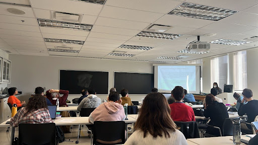

<figure>
  
  <figcaption> Yogi Joseph </figcaption>
</figure>

Our researcher Apoorva Rathod recently presented her research and fieldwork experiences as part of the Brown Bag Seminar Series, Dept of Geography, Planning & Environment. The seminar series brings together researchers to share their research with the members of the department. Below is an abstract for Apoorva’s talk:  

While there has been a significant rise in investments in large public transit projects in Asian cities, the “first and last mile” of these transport journeys is largely ignored. In many cities of the Global South, informal transport systems often step in to fill these gaps in the transport journey. This study explores such informal transport systems and their connections with large public transit projects in two megacities in Asia—Delhi and Metro Manila—using a gender lens. Informal transport systems contrast greatly with the Metro and Mass Rapid Transit journeys in Delhi and Manila respectively. In both cities, gender and class relations mediate the mode of informal transport used. While gender relations become more visible while waiting for and riding in rickshaws in Delhi as compared with the Metro, they seem to disassemble in the jeepney ride in Manila. The different kinds of spatialities and temporalities surrounding large transport infrastructure systems create shifting gendered and classed identities, where the marginalized constantly negotiate their agency.

 
