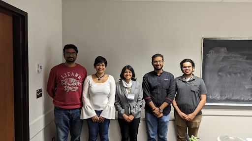

<figure>
  
  <figcaption> From L-R : Yogi Joseph, Sreelakshmi R, Manisha     Anantharaman, Jacob Baby, Suvedh Jayavant </figcaption>
</figure>

Prof. Manisha Anantharaman visited the team in March 2023. During the brief interaction, the researchers had a chance to present their current research and Manisha provided insightful feedback, while recounting her doctoral education experiences.  She also spoke in detail about her fieldwork experiences chronicling <a href="https://journals.sagepub.com/doi/abs/10.1177/1469540516634412" target="_blank">the elite and everyday cyclists of Bangalore</a>; the debates around active mobility and transport policymaking in Indian cities. 
 

Prof. Anantharaman is an Associate Professor of <a href="https://www.stmarys-ca.edu/justice-community-and-leadership" target="_blank">Justice, Community and Leadership</a> at Saint Mary's College of California in the Bay Area, where she teaches courses on environmental justice, sustainability and development through the lenses of postcolonial/decolonial theory, feminist geography and cultural sociology. More details about her work can be found at her <a href="https://www.manishaanantharaman.com" target="_blank"> website</a>.

