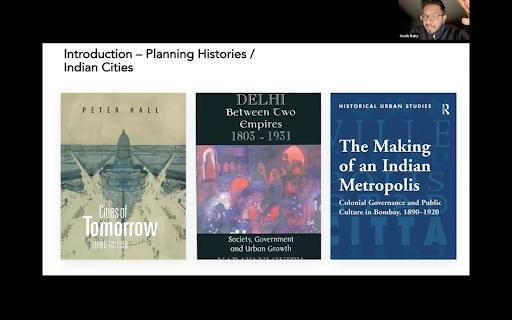

<figure>
  
  <figcaption> Jacob presentation </figcaption>
</figure>

Jacob Baby presented at the Royal Geographic Society (RGS) Annual Conference RGS-IBG in August 2023. Jacob’s presentation was part of the panel in New & Emerging Research in Historical Geography. The presentation titled, “Planning Histories on Indian Cities : Methodological Opportunities & Challenges” talked about Jacob’s research on writing planning histories especially transport planning history with aid of archives, planning documents, reports etc. The talk can be viewed <a href="https://vimeo.com/860885915/98df9c22ed?ts=2884000&share=copy" target="_blank">here</a>. 
 