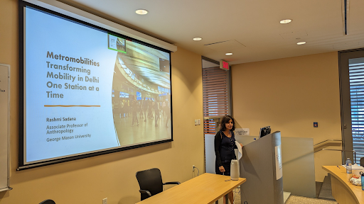
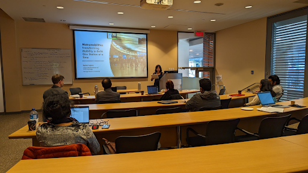
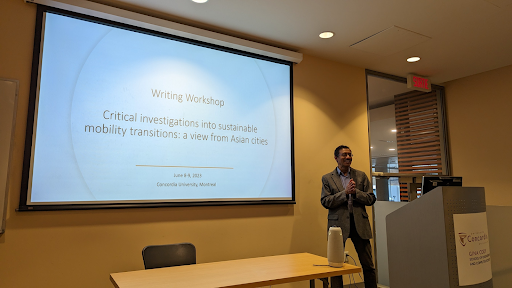
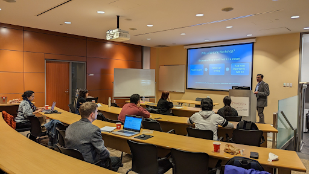

<figure>
  
  <figcaption> Prof. Rashmi Sadana </figcaption>
</figure>

The Sustainable Mobility Transitions in Asian Cities workshop was held on June 08-09 2023 at Concordia University, Montreal. This workshop hosted by Prof.Govind Gopakumar and team brought together several researchers working in this thematic to prepare their papers for submission to a special issue in The Journal of Environment Policy & Planning. Over two days, the workshop participants presented their paper outlines, provided feedback to the cohort and shared their writing tips and experiences with each other. 
 

The first day of the workshop ended with a keynote presentation by  Prof. Rashmi Sadana’s talk, “Metromobilities: Transforming Mobility in Delhi One Station at a time”. Her talk touched upon the various mobilities and materialities of the Dehli Metro, and how Delhi becomes a moving city with flows of bodies, capital etc. Her talk drew upon her extensive fieldwork in Delhi that included methods such as participant observation, ethnography and interviews with key planners and officials. The talk also focused on themes of the politics of planning, gendered mobilities, and transport infrastructures in a city like Delhi. Sadana’s book, “Metronama : Scenes from Delhi Metro” was also a key focus point in the talk. 
 

Prof. Rashmi Sadana is an <a href="https://soan.gmu.edu/people/rsadana" target="_blank">Associate Professor of Anthropology at George Mason University</a> and directs the Urban Research Hub there. She is the author of <a href="https://www.ucpress.edu/book/9780520383968/the-moving-city" target="_blank">The Moving City: Scenes from the Delhi Metro and the Social Life of Infrastructure (2022)</a> and <a href="https://www.ucpress.edu/book/9780520269576/english-heart-hindi-heartland" target="_blank"> English Heart, Hindi Heartland: The Political Life of Literature in India (2012)</a>.

<figure>
  
  <figcaption> Prof. Rashmi Sadana </figcaption>
</figure>

<figure>
  
  <figcaption> Prof. Govind Gopakumar </figcaption>
</figure>

<figure>
  
  <figcaption> </figcaption>
</figure>
