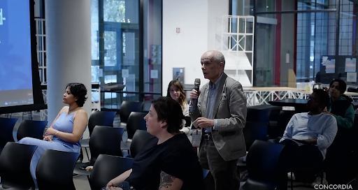

<figure>
  
  <figcaption> Yogi Joseph </figcaption>
</figure>

Link to program: <a href="https://www.concordia.ca/cuevents/offices/provost/fourth-space/programming/2023/10/06/south-asia-speaker-series.html?c=/next-gen/4th-space/programming" target="_blank">here</a>    Link to YouTube video: <a href="https://youtu.be/F3ibuflGMfM" target="_blank">here</a> 
 

Notes: The planning and implementation of mass rapid transit projects in Indian cities is steeped in discourses of aspiration and world-classness. Media coverage is key to the formation, circulation and reinforcement of such discourses. Based on his fieldwork in Kochi (IND), Yogi’s talk examined how rapidness and world-classness are encountered in the media coverage of the city’s metrorail project, as presented in both English and vernacular language newspapers. The metrorail project was portrayed as a significant stride towards achieving an aspirational "metro(politan)" status for Kochi. The pre-existing unevenness in the city's mobility infrastructure was painted as an obstacle, tackled through the introduction of a rail-based mass rapid transit system. Yogi emphasized that Ideas of rapidness pervade not just the transit solution, but also the coverage of the implementation and embedding of the metrorail project. Newspapers showcased the transformation of streets, transit spaces, and mobility modes as examples of Kochi’s new world-classness, often detached from everyday experiences of moving in the city. In summary, his presentation emphasized the importance of the language and discourse surrounding transit projects, while connecting them to wider conversations about the deployment of infrastructure in the ongoing world-classing of Indian cities.

 

<figure>
  
</figure>